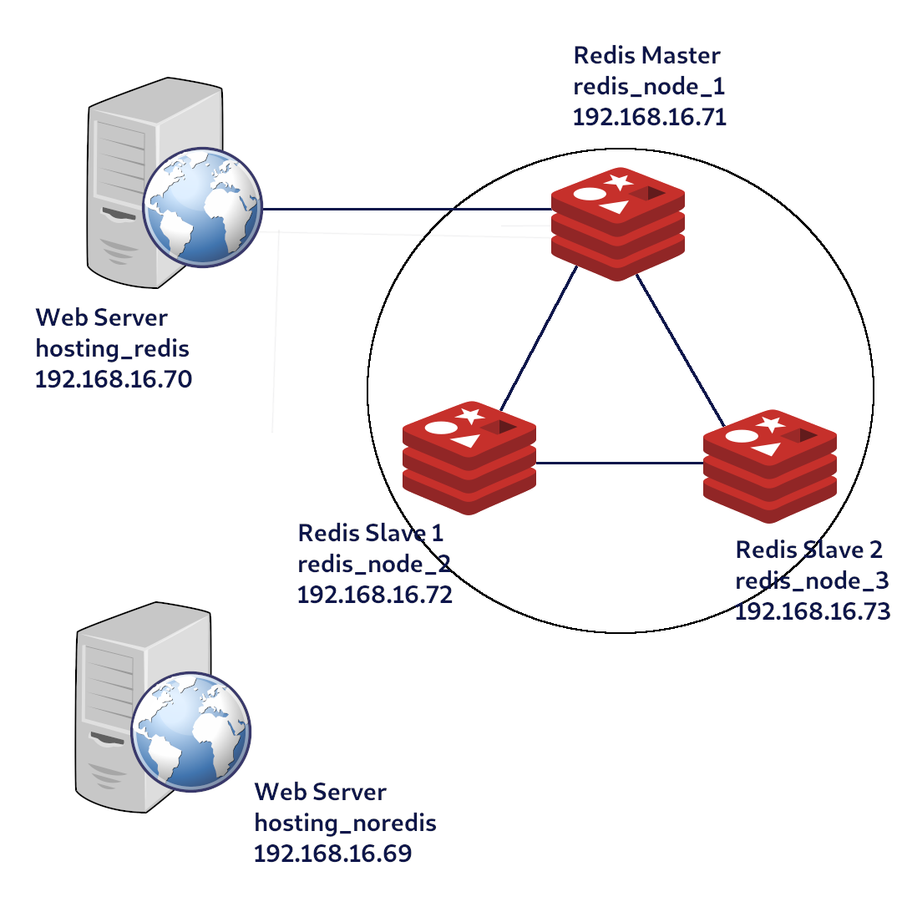
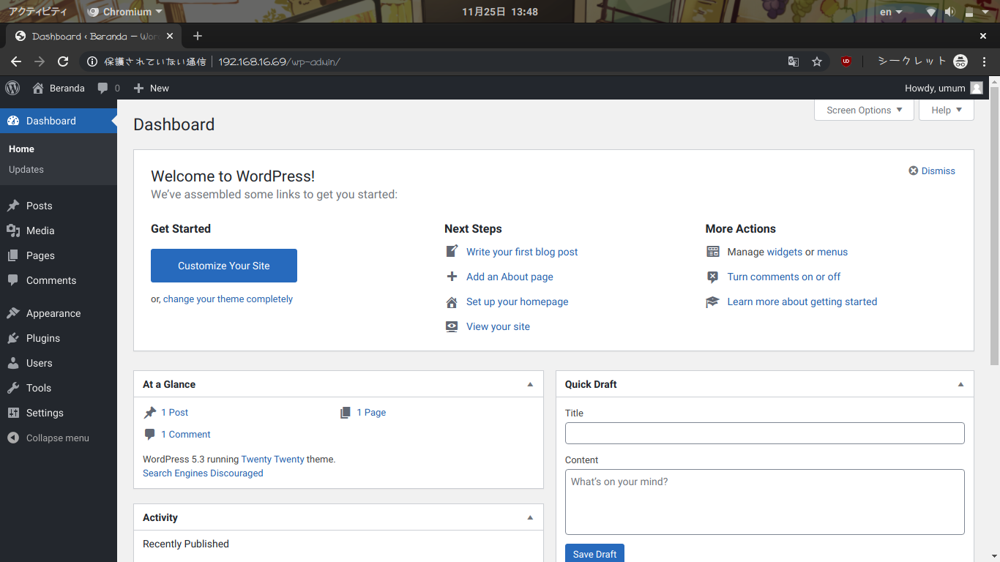

# Redis-Cluster <!-- omit in toc -->

<!-- Please don't mess this one like mongodb and mysql last time -->

Name: Deddy Aitya P.  
NRP: 05111640000069

## Table of Contents <!-- omit in toc -->

- [Configuration and Architechture](#configuration-and-architechture)
  - [Redis Cluster](#redis-cluster)
  - [Web Server](#web-server)
- [Load Testing](#load-testing)
- [Redis Failover Testing](#redis-failover-testing)


## Configuration and Architechture



There are 5 nodes available on this setup. Here's the IP configuration of the nodes:

```
192.168.16.69 -> hosting_noredis
192.168.16.70 -> hosting_noredis
192.168.16.71 -> redis_node_1 (master)
192.168.16.72 -> redis_node_2 (slave-1)
192.168.16.73 -> redis_node_3 (slave-2)
```

All nodes use `bento/ubuntu18.04` image with 512 MB of RAM.

### Redis Cluster

For the redis cluster, I'm using the `redis-server` and `redis-sentinel` package that is provided by ubuntu's official repository. I use the template provided by ubuntu installation and changed it a bit. Here's some important changes that I've made to the configs.

**/etc/redis/redis.conf [master]**
```
logfile /var/log/redis/redis-server.log
....
#bind 127.0.0.1 ::1
protected-mode no
....
dir /var/lib/redis
```

**/etc/redis/redis.conf [slave]**
```
logfile /var/log/redis/redis-server.log
....
#bind 127.0.0.1 ::1
protected-mode no
....
dir /var/lib/redis
....
slaveof 192.168.16.71 6379
```

**/etc/redis/sentinel.conf [all]**
```
logfile /var/log/redis/redis-sentinel.log
....
protected-mode no
port 26379
....
sentinel myid f9ec5167d09a1d9677a0c3b3630163dfe8f8444b
....
sentinel monitor mymaster 192.168.16.71 2
sentinel down-after-milliseconds mymaster 5000
sentinel failover-timeout mymaster 10000
sentinel parallel-syncs mymaster 2
```

Here's some results after clustering:

**Redis' log**


**Redis Sentinel's log**


**`info replication`**


### Web Server

I'm using LEMP stack on this implementation instead LAMP because I'm more familiar with nginx instead apache2. Both webserver uses the almost exact config except the one uses redis, it needs a little additional lines on `wp-config.php`. Firstly, I prepared the nginx web server. Installed it using `sudo apt install nginx` then edit some essentials lines:

```
        root /var/www/html/wordpress;

        server_name _;

        location / {
                try_files $uri $uri/ /index.php?$args;
        }

        location ~ \.php$ {
                include snippets/fastcgi-php.conf;
                fastcgi_pass unix:/run/php/php7.2-fpm.sock;
        }
```

After that, I installed the next part of stack. PHP and its necessary extensions using command `sudo apt install php7.2-cli php7.2-fpm php7.2-mysql php7.2-redis php7.2-json php7.2-opcache php7.2-mbstring php7.2-xml php7.2-gd php7.2-curl`. Using `php-fpm` because nginx uses fpm to pass php file to interpreter.

The next part is database. I choose mariadb as RDBMS for wordpress. On the default install, the root password is unset so I can prepare the db for wordpress earlier by passing these SQL commands:

```sql
CREATE DATABASE wordpress CHARACTER SET utf8mb4 COLLATE utf8mb4_general_ci;
GRANT ALL ON wordpress.* TO 'wordpressuser'@'localhost' IDENTIFIED BY 'wordpresspassword';
FLUSH PRIVILEGES;
```

After that, I downloaded the wordpress archive file, extract it to `/var/www/html/wordpress` then chown it to the right user. Then I copied the prepared wp-config.php with the necessary setup.

For both setup, I use this configuration:
```php
define( 'DB_NAME', 'wordpress' );
define( 'DB_USER', 'wordpressuser' );
define( 'DB_PASSWORD', 'wordpresspassword' );
define( 'DB_HOST', 'localhost' );
define( 'DB_CHARSET', 'utf8' );
define( 'DB_COLLATE', '' );

define('AUTH_KEY',         'RANDOM STRING');
define('SECURE_AUTH_KEY',  'RANDOM STRING');
define('LOGGED_IN_KEY',    'RANDOM STRING');
define('NONCE_KEY',        'RANDOM STRING');
define('AUTH_SALT',        'RANDOM STRING');
define('SECURE_AUTH_SALT', 'RANDOM STRING');
define('LOGGED_IN_SALT',   'RANDOM STRING');
define('NONCE_SALT',       'RANDOM STRING');
```

Only for the one uses redis:

```php
define( 'WP_REDIS_CLIENT', 'predis' );
define( 'WP_REDIS_SENTINEL', 'mymaster' );
define( 'WP_REDIS_SERVERS', [
    'tcp://192.168.16.71:6379',
    'tcp://192.168.16.72:6379',
    'tcp://192.168.16.73:6379',
] );
```

Open the both webserver IP, then you'll be greeted with initial setup page:


Fill it with the necessary info. On this part, both the one who uses redis and the one who doesn't use redis has the same config.


After that, you can login to the admin panel using the last entered username and password on last configuration page. After that, you'll get the admin panel like this.



And the blog itself will looks like this.


From this part and beyond, the step is specific to the webserver that uses redis.

Firstly, we look up for Redis Object Cache plugin for wordpress.


Install the first one then activate it.


Open the settings page of Redis Object Cache


Then you'll be greeted with this interface. Click "Enable Object Cache" button.


Ouch, seems like the plugin don't want to connect with the cluster. 


According to log, there's an exception thrown in the "Diagnostic Message". I don't know if this a known error or something. Tried to google the error but no useful results found. So I decided to write it just to master.


I have to modify the `wp-config.php` file a little:

```php
define( 'WP_REDIS_CLIENT', 'predis' );
define( 'WP_REDIS_HOST', '192.168.16.71' );
#define( 'WP_REDIS_SENTINEL', 'mymaster' );
#define( 'WP_REDIS_SERVERS', [
#    'tcp://192.168.16.71:6379',
#    'tcp://192.168.16.72:6379',
#    'tcp://192.168.16.73:6379',
#] );
```

Refreshing the page and enabled it. And it worked.


## Load Testing

I use jmeter for load testing. Here's some configuration I use on jmeter in general:

Thread group options:


HTTP Request options:


The first test is testing the non-redis server with 50 requests. Here's the result:


Non-redis server with 169 requests:


And finally non-redis server with 269 requests:


The same test applies for the server that uses redis. Started with 50 requests:


169 requests:


And 269 requests:


**Overall results**

Using redis (?) | # of samples | Average | Deviation
----|----|----|----
no | 50 | 42 | 17
no | 169 | 23 | 9
no | 269 | 17 | 8
yes | 50 | 72 | 21
yes | 169 | 45 | 31
yes | 269 | 40 | 33

You can see the full csv on [testplan](testplan) directory.

The result itself is pretty surprising when the one that doesn't use redis has the smaller average value than the one uses it. 

## Redis Failover Testing

Last attempt to failover test. No slave promoted to master after the timeout over. I don't know why but I'm really sure that I've checked the config file and it's like the one from the linked tutorial.
